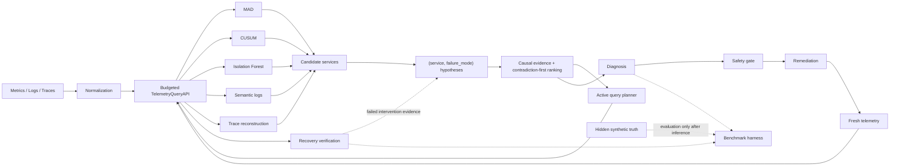

# The Midnight Ghost in Cluster 9

Budget-aware causal root-cause analysis for cascading microservice incidents.

The system consumes metrics, logs, and traces, identifies anomalous candidate services, tests explicit `(service, failure_mode)` hypotheses, plans only safety-gated remediation, and verifies recovery from fresh telemetry under one global query budget.

Synthetic incidents are used only for controlled evaluation. Hidden ground truth is never passed to RCA, remediation, or recovery verification.

**Live demo:** https://cluster9-incident-rca.streamlit.app/  
**Technical report:** [Midnight_Ghost_Technical_Report_Final.pdf](Midnight_Ghost_Technical_Report_Final.pdf)  
**Detailed whitepaper:** [docs/whitepaper.md](docs/whitepaper.md)

---

## Architecture



The important separation is:

```text
anomaly detection
      ↓
causal diagnosis
      ↓
permission to act
      ↓
remediation
      ↓
fresh telemetry
      ↓
recovery verification
```

An anomalous service is not automatically the root cause, and an applied action is not automatically a recovered system.

---

## Key design choices

- **MAD + CUSUM + Isolation Forest** provide independent robust, temporal, and multivariate anomaly signals.
- Candidate rule is explicit: **2/3 metric detectors ⇒ STRONG**, exactly one ⇒ WEAK, and one detector plus trace/log corroboration can promote the candidate.
- Logs, traces, metric signatures, temporal order, and graph propagation are stored as **SUPPORT / CONTRADICTION / NEUTRAL** evidence.
- Missing telemetry stays neutral instead of being treated as evidence against a hypothesis.
- Final ranking is **lexicographic and contradiction-first**; there is no arbitrary weighted confidence score.
- The active planner spends the remaining budget only on queries that can separate surviving hypotheses.
- The system supports **UNSUPPORTED** diagnosis when a root service can be localized but no known failure signature fits safely.
- Automatic remediation has a stricter threshold than diagnosis and requires **orthogonal direct evidence**.
- **APPLIED != VERIFIED**: recovery is accepted only after fresh telemetry checks.
- A failed applied intervention becomes explicit causal evidence against the attempted hypothesis.
- Healthy/no-fault controls are evaluated separately to make sure the agent does not act on healthy clusters.

---

## Repository structure

```text
The-Midnight-Ghost-in-Cluster-9/
├── main.py                         # deterministic CLI/reference incident
├── streamlit_app.py                # interactive demo
├── requirements.txt
├── Midnight_Ghost_Technical_Report_Final.pdf
├── approach.md
├── docs/
│   ├── whitepaper.md               # detailed design, experiments, trade-offs
│   └── final_benchmark_snapshot.json
│
├── src/
│   ├── core/
│   │   ├── models.py               # MetricEvent, LogEvent, SpanEvent
│   │   ├── normalization.py        # canonicalization/deduplication
│   │   ├── baseline.py             # healthy historical context
│   │   ├── telemetry.py            # telemetry store/query interface
│   │   └── budget.py               # global query budget
│   │
│   ├── rca/
│   │   ├── anomaly.py              # MAD, CUSUM, Isolation Forest
│   │   ├── candidates.py           # STRONG/WEAK candidate logic
│   │   ├── logs.py                 # semantic-log evidence
│   │   ├── graph.py                # trace graph / propagation reasoning
│   │   ├── signatures.py           # known failure signatures
│   │   ├── diagnosis.py            # causal evidence and ranking
│   │   ├── planner.py              # active query selection
│   │   └── agent.py                # RCA orchestration
│   │
│   ├── remediation/
│   │   ├── planner.py              # safety/action eligibility
│   │   ├── controller.py           # diagnosis → action → verification loop
│   │   ├── recovery.py             # fresh-telemetry recovery checks
│   │   └── domain.py               # remediation/state-transition types
│   │
│   ├── simulation/
│   │   ├── simulator.py            # deterministic microservice fleet
│   │   ├── faults.py               # fault behaviours
│   │   ├── generator.py            # incident generation
│   │   ├── remediation.py          # simulator action executor
│   │   └── config.py               # topology/fault configuration
│   │
│   ├── adapters/
│   │   ├── opentelemetry.py        # OTLP-style JSON/dict → canonical events
│   │   └── rcaeval.py              # RCAEval external-data adapter
│   │
│   ├── evaluation/
│   │   ├── benchmark.py            # benchmark runner
│   │   ├── profiles.py             # CLEAN / skew / missing / delay / noise / decoy
│   │   ├── ablations.py
│   │   ├── models.py
│   │   └── rcaeval_smoke.py        # external-data smoke runner
│   │
│   └── ui/
│       └── presentation.py          # Streamlit presentation helpers
│
└── tests/
    ├── test_core.py
    ├── test_observability.py
    ├── test_diagnosis.py
    ├── test_remediation.py
    ├── test_recovery.py
    ├── test_evaluation.py
    ├── test_opentelemetry.py
    ├── test_rcaeval.py
    ├── test_simulation.py
    └── test_ui_presentation.py
```

---

## Setup

Python **3.11+** is recommended.

### Windows / Git Bash

```bash
python -m venv .venv
source .venv/Scripts/activate
python -m pip install -r requirements.txt
```

### Linux / macOS

```bash
python -m venv .venv
source .venv/bin/activate
python -m pip install -r requirements.txt
```

Run the full test suite:

```bash
python -m pytest -q
```

Run the deterministic reference incident:

```bash
python main.py
```

Reference configuration:

```text
seed         = 17
service      = postgres
failure mode = database_slowdown
budget       = 17
```

The validated reference run resolves `postgres / database_slowdown`, plans `FAILOVER`, applies it, verifies recovery, and stays within the global budget.

---

## Interactive demo

Run locally:

```bash
python -m streamlit run streamlit_app.py
```

Then open the local URL printed by Streamlit, normally:

```text
http://localhost:8501
```

The demo has three views:

- **Overview** — topology, diagnosis, evidence, telemetry, action, recovery, and budget.
- **Investigation** — ranked hypotheses, candidates, causal evidence, and query history.
- **Evaluation** — robustness, ablation, budget sensitivity, plus evaluation-only hidden truth.

The simulator controls configure only the hidden injected incident. They are not passed as answers to the RCA engine.

Generated benchmark outputs under `outputs/` are intentionally gitignored. The deployed Evaluation view falls back to the checked-in validated snapshot at `docs/final_benchmark_snapshot.json`.

---

## Benchmarking

Quick deterministic run:

```bash
python -m src.evaluation.benchmark \
  --seeds 17 \
  --profiles CLEAN \
  --services postgres \
  --failure-modes database_slowdown \
  --output-dir outputs/quick
```

Full robustness profiles include:

```text
CLEAN
DEFAULT
CLOCK_SKEW
MISSING
DELAYED
NOISY
DECOY
COMBINED_STRESS
```

The evaluation harness reports exact/root/mode accuracy, diagnosis status, false resolutions, query cost, remediation outcomes, recovery outcomes, ablations, and budget sensitivity. Healthy/no-fault controls are reported separately from fault accuracy.

The report contains the validated benchmark numbers and their limitations.

---

## External telemetry

### OpenTelemetry

```python
from src.adapters import OpenTelemetryAdapter
from src.core import TelemetryQueryAPI, TelemetryStore

batch = OpenTelemetryAdapter().parse_export(otlp_json)

api = TelemetryQueryAPI(
    TelemetryStore(batch.metrics, batch.logs, batch.spans),
    total_budget=17,
)
```

The adapter converts representative OTLP metric, log, and span exports into the same canonical events used by the RCA pipeline.

A **live OpenTelemetry collector/receiver is not implemented**; the current boundary accepts OTLP-style JSON/dicts.

### RCAEval smoke test

```bash
python -m src.evaluation.rcaeval_smoke \
  --case-dir <local-case-directory> \
  --budget 17
```

RCAEval-specific field mapping remains isolated in the adapter/evaluation layer. External truth is joined only after inference.

---

## Known failure modes

The current signature library supports:

```text
cpu_saturation
deployment_regression
database_slowdown
connection_exhaustion
network_latency
process_crash
```

This is an extensible known-mode vocabulary, not a claim that these are all possible production failures. If a service can be localized but the observed mechanism does not fit a supported signature, the hardened RCA can abstain with `UNSUPPORTED` and block autonomous remediation.

---

## Current limitations

- The simulator is a controlled benchmark, not a model of real incident frequency.
- The known signature library covers six failure families.
- Semantic log quality depends on a generic pretrained embedding model or the explicit lexical fallback.
- Missing/fragmented telemetry can lead to AMBIGUOUS, INCOMPLETE_BUDGET, or INCONCLUSIVE outcomes.
- The OpenTelemetry adapter is an ingestion boundary, not a live collector.
- External RCAEval support is a smoke-test adapter, not a claim of production-level external accuracy.

See the [technical report](Midnight_Ghost_Technical_Report_Final.pdf) and [whitepaper](docs/whitepaper.md) for the full approach, trade-offs, experiments, and limitations.
