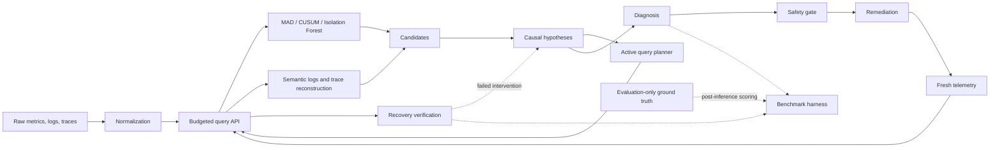

# Budget-Aware Causal RCA for Microservices

This project diagnoses cascading microservice incidents as explicit `(service, failure_mode)` hypotheses, plans safety-gated remediation, and verifies recovery from fresh telemetry under one global query budget. Synthetic incidents are controlled evaluation fixtures; their ground truth is never available to RCA, remediation, or recovery verification.

## Architecture



`src/core` owns canonical telemetry, baselines, and the budgeted query boundary. `src/rca` contains generic observability and causal diagnosis. `src/remediation` owns safety planning, execution contracts, orchestration, and recovery verification. `src/simulation` is an isolated deterministic benchmark backend. `src/adapters` contains production-facing ingestion, and `src/evaluation` joins hidden truth only after inference completes.

## Setup and validation

Python 3.11 or newer is required.

```bash
python -m venv .venv
python -m pip install -r requirements.txt
python main.py
python -m pytest -q
```

The demo is fixed to seed 17 with `postgres/database_slowdown`; it should resolve, apply `FAILOVER`, verify recovery, and stay within 17 query-cost units.

## Interactive demo

Install the project dependencies and start the dashboard:

```bash
python -m pip install -r requirements.txt
streamlit run streamlit_app.py
```

The Streamlit demo runs the real incident, diagnosis, safety-planning, remediation,
fresh-observation, and recovery-verification pipeline under one visible query
budget. Its investigation workspace keeps the causal propagation map, diagnosis,
phase-aware telemetry, autonomous response, and budget together in the primary
view. Separate Investigation and Evaluation views retain the technical evidence
and saved benchmark artifacts. Fault-injection controls and hidden ground truth
remain explicitly isolated as evaluation-only inputs and outputs.

## Benchmarks

Quick deterministic run:

```bash
python -m src.evaluation.benchmark --seeds 17 --profiles CLEAN --services postgres --failure-modes database_slowdown --output-dir outputs/quick
```

Full valid fault matrix across three seeds and every robustness profile:

```bash
python -m src.evaluation.benchmark --seeds 1 2 3 --profiles CLEAN DEFAULT CLOCK_SKEW MISSING DELAYED NOISY DECOY COMBINED_STRESS --output-dir outputs/full
```

Ablations and a budget curve:

```bash
python -m src.evaluation.benchmark --seeds 17 --profiles CLEAN --services postgres --failure-modes database_slowdown --ablations FULL_SYSTEM NO_SEMANTIC_LOG_EVIDENCE NO_TRACE_EVIDENCE NO_ISOLATION_FOREST NO_CUSUM NO_MAD METRICS_ONLY --budget-curve 8 10 12 14 17 20 --output-dir outputs/studies
```

The CLI derives valid service/failure-mode pairs from `SimulationConfig`. Generated `benchmark_results.csv`, `benchmark_summary.json`, `ablation_results.csv`, and `budget_curve.csv` files live under the selected ignored `outputs/` directory.

## OpenTelemetry JSON/dict ingestion

```python
from src.adapters import OpenTelemetryAdapter
from src.core import TelemetryQueryAPI, TelemetryStore

batch = OpenTelemetryAdapter().parse_export(otlp_json)
api = TelemetryQueryAPI(
    TelemetryStore(batch.metrics, batch.logs, batch.spans),
    total_budget=17,
)
```

The adapter accepts representative OTLP metric, log, and span exports, including nanosecond Unix timestamps and `service.name` resource attributes. It performs no network collection.

## Documentation and limitations

The [technical whitepaper](docs/whitepaper.md) describes algorithms, safety boundaries, experiments, and results. The simulator is a controlled benchmark rather than a production-frequency model. Recovery remains conservative, semantic inference depends on a generic pretrained embedding model (with an explicit lexical fallback), and the JSON adapter is not a live OTLP collector.
