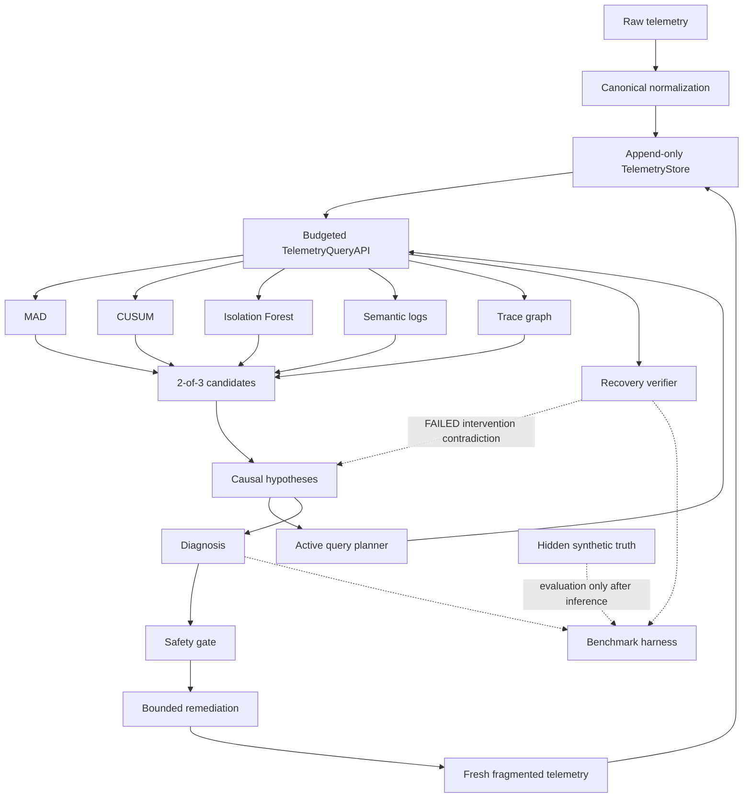

# Budget-Aware Causal Root-Cause Analysis and Verified Recovery

## 1. Problem Statement

Distributed incidents generate fragmented metrics, logs, and traces across services with different clocks and delivery delays. The task is to diagnose an exact `(service, failure_mode)` pair, spend a bounded telemetry-query budget, apply only a safe single-service action, and distinguish command acceptance from evidence-backed recovery.

## 2. Design Goals and Constraints

The system is service-name and topology agnostic. It uses no Bayesian root-cause classifier, synthetic-label-trained supervised model, weighted final RCA score, GNN, or reinforcement learner. Synthetic incidents provide controlled benchmarks and hidden truth, not training data. Diagnosis, remediation, and recovery verification cannot access ground truth.

The five-part causal ordering is frozen: contradiction count, unexplained strong candidates, explained strong candidates, supporting evidence-category count, and direct root-support category count. Service and failure-mode names break ties only after this causal key.

## 3. System Architecture



Core telemetry is backend independent. Simulation owns internal state and truth. Evaluation may import every layer but joins truth only after an agent/controller run returns.

## 4. Telemetry Canonicalization

Immutable `MetricEvent`, `LogEvent`, and `SpanEvent` records preserve event time separately from arrival time. The normalizer converts timestamps to UTC, normalizes service/severity/unit representations, and deterministically deduplicates by semantic identity while retaining the earliest arrival.

`TelemetryStore` supports append-only ingestion through the query boundary. Cache invalidation compares only queries changed by a new batch; unaffected exact queries remain zero-cost hits. Query budget and audit history persist across diagnosis and post-action observation.

## 5. Synthetic Fleet and Fault Injection

The configurable discrete-time fleet models demand, capacity, queues, retries, local latency, dependency latency, errors, and availability. Six behavioural faults are supported: CPU saturation, deployment regression, database slowdown, connection exhaustion, network latency, and process crash. Faults alter service behaviour rather than directly painting diagnosis answers onto telemetry.

Fragmentation independently applies service clock offsets to event timestamps, delivery delays to arrival timestamps, missing observations, metric noise, and unrelated decoys. A stateful incident session retains the simulator and fragmentation RNG trajectories, offsets, decoys, queues, and normalizer across remediation.

## 6. Observability Intelligence

### MAD

For each metric sample, the robust detector computes `0.67448975 * (x - median) / dispersion`. Dispersion prefers baseline MAD, then scaled standard deviation, then a small relative fallback. A service-level flag requires sustained anomalous samples/fraction or an extreme deviation; raw per-metric scores are retained.

### CUSUM

Bidirectional CUSUM operates on baseline-dispersion-normalized samples. Drift and threshold are expressed in standardized units, and a flag requires a sustained directional run rather than one isolated sample.

### Isolation Forest

A deterministic Isolation Forest is trained only on aligned healthy historical vectors. Its portable core uses CPU, memory, request latency, error rate, and request rate. Fixed `random_state`, explicit contamination, minimum sample counts, and anomalous-fraction gates prevent a small number of outliers from becoming a service-wide flag.

### Semantic logs

Logs are embedded with the generic pretrained `sentence-transformers/all-MiniLM-L6-v2` representation and compared with multiple generic prototypes per category. Low similarity yields UNKNOWN. A tested TF-IDF lexical fallback remains explicit for offline/model failure; it is not a synthetic-label model. Signature-specific log support must align with robust metric onset when onset is available.

### Trace reconstruction

Service-seeded queries return complete available trace trees. Parent/child identities reconstruct dependency edges without relying on synchronized cross-service clocks. Localization separates dependency-duration bounds from residual local work and preserves UNKNOWN/MIXED outcomes when evidence is incomplete.

## 7. Candidate Generation

The frozen rule is exact: two or more available metric detectors yield STRONG; one yields WEAK; one plus trace/log corroboration yields STRONG; zero metric detectors is not a candidate. Ablated detectors are unavailable, not fabricated negative observations.

## 8. Causal Hypothesis Generation and Elimination

Every non-empty service candidate is paired with each declarative failure signature. Required metric directions, semantic categories, trace expectations, graph propagation, and temporal evidence produce explicit SUPPORT, CONTRADICTION, or NEUTRAL records. A required observed-normal metric contradicts a defining signature; missing telemetry remains neutral.

Strong candidates unexplained by a proposed root remain explicit. Ranking is lexicographic and contradiction-first, with no aggregate weighted score. Equal causal keys remain ambiguous.

## 9. Active Budget-Aware Query Planning

The agent bootstraps metrics exhaustively when affordable, otherwise uses a deterministic topology-prioritized subset and reports `INCOMPLETE_BUDGET`. The active planner chooses affordable uncached metric/log/trace queries by pair-separation benefit per configured query cost. All evidence gathering shares one global budget.

## 10. Safe Remediation

A declarative allowlist maps six failure modes to SCALE_UP, ROLLBACK, FAILOVER, RECYCLE_CONNECTIONS, REROUTE, or RESTART. Execution is permitted only for a RESOLVED, STRONG, contradiction-free hypothesis with direct root log or trace confirmation and exactly one known target. Other cases are blocked.

## 11. Recovery Verification

`APPLIED` means only that a command was accepted. The verifier queries fresh metric tails for the diagnosed root, causally explained strong services, and one eligible healthy sentinel. VERIFIED requires sufficient required-root samples normalized to NORMAL, no residual STRONG metric candidate in the affected region, request-rate continuity above 50% of baseline, and a healthy sentinel. Persistent defining direction, collapsed traffic, or a newly STRONG sentinel is FAILED. Missing, unaffordable, mixed, or still-draining evidence is INCONCLUSIVE.

## 12. Failed Intervention as Causal Evidence

A decisive FAILED verification after an APPLIED action creates one `INTERVENTION_OUTCOME` contradiction for the exact attempted pair. Normal contradiction-first ranking then weakens it during follow-up investigation. Blocked, rejected, and inconclusive attempts do not create that evidence, and the controller does not repeat the action automatically.

## 13. OpenTelemetry Portability

The simulator-independent adapter converts representative OTLP JSON/dicts into canonical events. It supports `service.name` resources, nanosecond Unix timestamps, metric gauge/sum points, log severity text/numbers and trace linkage, and span start/end or duration plus status. Malformed required identifiers and timestamps raise `OpenTelemetryParseError`. Compatible structured linkage is preserved, but the canonical models intentionally do not retain arbitrary attribute bags. Live collector/network integration is outside the current scope.

## 14. Experimental Setup

The evaluation harness derives every valid `(service, failure_mode)` from `SimulationConfig`, evaluates deterministic seeds, and records diagnosis, remediation, recovery, and cost fields per incident. Exact/root/mode accuracy requires a RESOLVED result. False-resolution rate is wrong RESOLVED results divided by all RESOLVED results. P95 cost uses the deterministic nearest-rank definition.

Named controlled profiles are:

| Profile | Clock skew | Missing | Delayed | Noise | Decoy |
|---|---:|---:|---:|---:|---:|
| CLEAN | 0 s | 0% | 0% | 0% | no |
| DEFAULT | 4 s | 2% | 5%, max 20 s | 2% | yes |
| CLOCK_SKEW | 15 s | 0% | 0% | 0% | no |
| MISSING | 0 s | 15% | 0% | 0% | no |
| DELAYED | 0 s | 0% | 35%, max 45 s | 0% | no |
| NOISY | 0 s | 0% | 0% | 8% | no |
| DECOY | 0 s | 0% | 0% | 0% | yes |
| COMBINED_STRESS | 15 s | 15% | 35%, max 45 s | 8% | yes |

These are controlled stress tests, not claims about production frequencies.

## 15. Benchmark Results

The final validation run and its exact generated results are reported here after executing the checked-in harness. No unavailable or estimated values are substituted.

Command:

```text
python -m src.evaluation.benchmark --seeds 1 2 --profiles CLEAN DEFAULT --budget 17 --verification-steps 150 --output-dir outputs/final-matrix
```

This covered all 45 valid configured pairs for two seeds (90 incidents per profile, 180 total) and ran in 2109.89 seconds.

| Metric | CLEAN | DEFAULT |
|---|---:|---:|
| Exact pair accuracy | 98.9% | 66.7% |
| Root-service accuracy | 98.9% | 66.7% |
| Failure-mode accuracy | 98.9% | 68.9% |
| RESOLVED | 89 (98.9%) | 70 (77.8%) |
| AMBIGUOUS | 1 (1.1%) | 20 (22.2%) |
| INCOMPLETE_BUDGET / NO_CANDIDATES | 0 / 0 | 0 / 0 |
| False resolutions | 0 (0% of resolved) | 10 (14.3% of resolved) |
| Diagnosis cost mean / median / p95 | 10.06 / 10 / 10 | 10.57 / 10 / 13 |
| Safely planned | 89 (98.9%) | 70 (77.8%) |
| VERIFIED / FAILED / INCONCLUSIVE | 55 / 11 / 23 | 31 / 14 / 25 |
| Correct target among planned | 100% | 85.7% |
| Total cost mean / median / p95 | 14.52 / 14 / 17 | 14.59 / 15 / 17 |
| Blocked actions | 1 | 20 |
| Wrong action incorrectly VERIFIED | 0 | 0 |

DEFAULT's ten false resolutions are a material limitation under combined ordinary fragmentation; the harness exposes them rather than treating the overall test pass as evidence of benchmark precision.

## 16. Robustness Tests

Robustness profiles are reported separately; aggregation does not hide stress-profile failures.

The complete 45-pair matrix was run under CLEAN and DEFAULT above. A separate same-case comparison across all eight named profiles used the seven-case seed-17 subset from the ablation study:

```text
python -m src.evaluation.benchmark --seeds 17 --profiles CLEAN DEFAULT CLOCK_SKEW MISSING DELAYED NOISY DECOY COMBINED_STRESS --services postgres catalog auth --failure-modes database_slowdown cpu_saturation process_crash --budget 17 --verification-steps 150 --output-dir outputs/final-robustness
```

Runtime was 642.96 seconds.

| Profile | Exact | Resolved | Verified | False resolutions | Mean total cost |
|---|---:|---:|---:|---:|---:|
| CLEAN | 100% | 100% | 57.1% | 0 | 15.14 |
| DEFAULT | 85.7% | 85.7% | 57.1% | 0 | 14.71 |
| CLOCK_SKEW | 71.4% | 85.7% | 28.6% | 1 | 16.00 |
| MISSING | 100% | 100% | 57.1% | 0 | 15.14 |
| DELAYED | 100% | 100% | 57.1% | 0 | 15.14 |
| NOISY | 100% | 100% | 0% | 0 | 10.14 |
| DECOY | 100% | 100% | 57.1% | 0 | 15.14 |
| COMBINED_STRESS | 57.1% | 71.4% | 0% | 1 | 10.86 |

No profile incorrectly marked a wrong action VERIFIED. Noise and combined stress most visibly reduced recovery verification, while strong skew and combined stress also caused false resolutions in this small subset.

## 17. Ablation Study

The harness supports FULL SYSTEM, NO SEMANTIC LOG EVIDENCE, NO TRACE EVIDENCE, NO ISOLATION FOREST, NO CUSUM, NO MAD, and METRICS ONLY. Dependencies are injected explicitly. Default construction is behaviourally equivalent to the production agent. Queries that become uninformative under an ablation still consume their configured cost, avoiding an unfair budget refund.

Command (seven valid cases derived from three services and three requested modes, seed 17, CLEAN):

```text
python -m src.evaluation.benchmark --seeds 17 --profiles CLEAN --services postgres catalog auth --failure-modes database_slowdown cpu_saturation process_crash --budget 17 --ablations FULL_SYSTEM NO_SEMANTIC_LOG_EVIDENCE NO_TRACE_EVIDENCE NO_ISOLATION_FOREST NO_CUSUM NO_MAD METRICS_ONLY --budget-curve 8 12 17 20 --verification-steps 150 --output-dir outputs/final-studies
```

The combined study ran in 889.02 seconds.

| Ablation | Exact | Resolved | Verified | Mean total cost |
|---|---:|---:|---:|---:|
| FULL SYSTEM | 100% | 100% | 57.1% | 15.14 |
| NO SEMANTIC LOG EVIDENCE | 0% | 0% | 0% | 12.71 |
| NO TRACE EVIDENCE | 100% | 100% | 57.1% | 15.14 |
| NO ISOLATION FOREST | 100% | 100% | 57.1% | 15.14 |
| NO CUSUM | 100% | 100% | 57.1% | 14.43 |
| NO MAD | 100% | 100% | 57.1% | 14.43 |
| METRICS ONLY | 0% | 0% | 0% | 11.00 |

This small controlled subset shows semantic confirmation was necessary for resolution under the frozen safety/ambiguity rules. It does not establish that traces or any individual detector are generally unnecessary; those removals happened not to change these seven outcomes.

## 18. Query Budget Tradeoff

Each budget point regenerates the identical seed/service/failure matrix and changes only the global query budget.

| Budget | Exact | Resolved | Incomplete budget | Mean usage |
|---:|---:|---:|---:|---:|
| 8 | 0% | 0% | 100% | 8.00 |
| 12 | 100% | 100% | 0% | 12.00 |
| 17 | 100% | 100% | 0% | 15.14 |
| 20 | 100% | 100% | 0% | 15.14 |

For this subset, budget 12 crossed the resolution threshold; larger budgets did not force spending beyond useful verification queries.

## 19. Safety, Failure Modes, and Limitations

- Simulator coverage is controlled and cannot establish real-world incident prevalence.
- The benchmark topology and signatures cover six fault families, not every production mechanism.
- Semantic quality depends on a generic pretrained model or its explicitly weaker lexical fallback.
- Missing telemetry can make safe resolution or recovery verification impossible; the system reports incompleteness rather than guessing.
- Required-normal recovery gates are intentionally conservative and can delay VERIFIED while queues drain.
- OTLP support is deterministic JSON/dict ingestion, not a collector, exporter, or arbitrary-attribute archive.
- Ablations measure this implementation and benchmark; they do not establish universal component importance.

## 20. Future Work

Future work includes a live OpenTelemetry receiver, production authorization/audit integrations for executors, broader signature libraries, long-running temporal stores, human-in-the-loop operational UX, and evaluation against independent real incident corpora. These additions must preserve truth isolation, explicit uncertainty, and the global telemetry budget.
